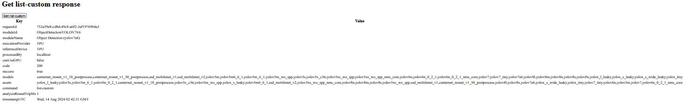
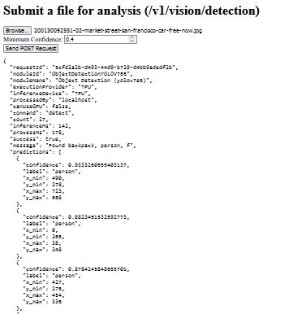
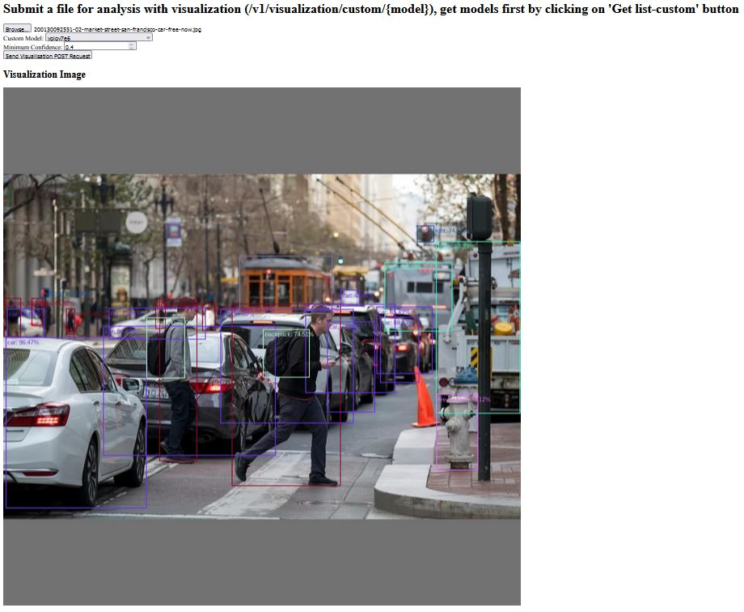
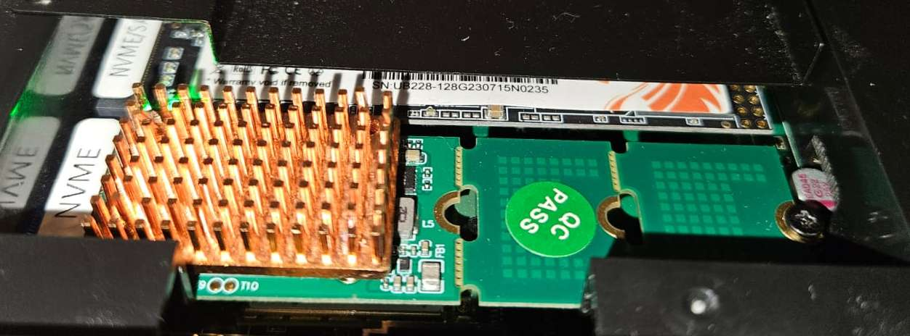

# Hailo object detection mini server

## Description

A local AI object detection server compatible with [Codeproject.AI](https://github.com/codeproject/CodeProject.AI-Server) 
API request/responses, so it can be used instead of Codeproject.AI with [Frigate](https://github.com/blakeblackshear/frigate) 
and [Blue Iris](https://blueirissoftware.com/) VCR software   
The server is using precompiled available Hailo models and binaries, can run locally and as a Docker container. It has 
a primitive Web UI for debugging.
The project is in its early state and mostly a POC. Most of the code was taken from 
[Hailo AI GitHub](https://github.com/hailo-ai), in particular from 
https://github.com/hailo-ai/Hailo-Application-Code-Examples/tree/main/runtime/python/object_detection so this project 
goes under same MIT License

## Requirements

 - Hailo 8 or Hailo 8L AI accelerator
 - Ubuntu 22.04 Host machine 
 - Docker (optional)

 Was tested on i5-1340P with 32Gb RAM, and RPi5. Docker container consumes around 300 Mb in Idle and up to 600 Mb 
 during inference so something around 8Gb should be fine. CPU is used mostly during image resizing, so the faster, 
 the better, but for small applications it should not be that critical.

## Web UI

There is a primitive Web UI implemented for debugging purposes. There are 3 endpoints that a user can get access to
through UI:
 - `POST` `/v1/vision/custom/list` - shows a list of available models. Note: models must be downloaded manually from
Hailo AWS bucket
   
 - `POST` `/v1/vision/detection` - main endpoint used by Frigate and Blue Iris for object detection.
   
 - `POST` `/v1/visualization/custom/{model_name}` - a helper endpoint (not from Codeproject.AI) to create an image with 
masks for detected objects. Image is stored locally and can be displayed in Web UI. Very helpful for debugging and 
comparing models.
   
The image for analysis is taken from 
[CNN Travel](https://www.cnn.com/travel/article/market-street-san-francisco-car-free-now/index.html),
Credits: David Paul Morris/Bloomberg/Getty Images

Note: a POST request to `/v1/visualization/custom/{model_name}` changes current model used, so it will be used in
`/v1/vision/detection` call as well. 
To populate a model list in the dropdown, get models first - click on 'Get list-custom' button at the top of the page.
The files with masks are also created in `output_images` where they can be taken for further analysis. Note that the 
files are in the size of model input, might be with padding, as on the screenshot. Masking on an original image 
is not implemented.

## Installation

1. Prepare Ubuntu 22.04 machine with a free m2 NVME slot. Hailo specifies this OS as compatible with its software.
For working with visualization endpoint the system must have ttf fonts installed. If any UI is installed, it should be 
enough.
2. Important! Install a heatsink above Hailo 8 chip. Author used a copper heatsink 30x20x7 with a thermal paste in 
between and DIY 2 M2 holes with threads in the heatsink.
   
3. Register on [Hailo AI Developer Zone](https://hailo.ai/developer-zone/) and download the following files (`amd64` for Intel CPU machines, for
RPi5 - `arm64`, use other architectures if needed):
 - `hailort-pcie-driver_4.19.0_all.deb`
 - `hailort_4.19.0_amd64.deb`
 - `hailort-4.19.0-cp310-cp310-linux_x86_64.whl`

    4.19.0 is the latest version published at the moment of development, and it was used for this project. Other 
versions are not guaranteed to work.

4. Download precompiled models from Hailo AI GitHub:
 - [Hailo 8](https://github.com/hailo-ai/hailo_model_zoo/blob/master/docs/public_models/HAILO8/HAILO8_object_detection.rst)
 - [Hailo 8L](https://github.com/hailo-ai/hailo_model_zoo/blob/master/docs/public_models/HAILO8L/HAILO8L_object_detection.rst)

Download `Compiled` models (the rightest column). Hailo 
[claims](https://github.com/hailo-ai/Hailo-Application-Code-Examples/blob/main/runtime/python/object_detection/README.md#supported-models)
that only models that allow hailort-postprocess can be used: yolov5/6/7/8, yolox, ssd, centernet. But the Author was
not able to run published centernet* and yolov6n_0_2_1 models with this code. Not sure about the reason yet.
5. Clone this repo to the machine, `cd` to the root of repo - all the commands are executed from the repo root.
6. Copy files from p.3 to `hailo_assets` folder
7. Copy models from p.4 to `models` folder. You need at least one model, that is specified in
`config.py:Config:default_model_name`. It does not have to be that one, but change that var if you use another model 
by default.
8. For RPi5 and Hailo-8L use the 
  [official manual for installation](https://github.com/hailo-ai/hailo-rpi5-examples/blob/main/doc/install-raspberry-pi5.md#how-to-set-up-raspberry-pi-5-and-hailo-8l)
9. For desktop machines install PCIE Hailo driver on the host machine. The installation is described in 
[Hailo Development Zone](https://hailo.ai/developer-zone/documentation/hailort-v4-18-0/?sp_referrer=install/install.html#installing-pcie-driver-only)
but it might be needed to do some extra steps. First, install dev packages and dkms
```commandline
sudo apt update
sudo apt install build-essential g++-12 gcc-12 linux-headers-$(uname -r) dkms 
```
then install PCIe driver
```commandline
dpkg -i hailort-pcie-driver_4.19.0_all.deb
```
if for any reason driver installation was not successful, purge it before runninng it again
```commandline
sudo dpkg --purge --force-all hailort-pcie-driver
```
10. RPi5 only. `hailo-all` package has an old (4.17) version HailoRT. If it is still the case, reinstall it. Follow the
[official forum](https://community.hailo.ai/t/still-unable-to-run-4-18-on-rpi5/1985/14) as there may be changes
11. RPi5 only. If you are going to use visualization endpoint, install `fonts-liberation` package:
`sudo apt install fonts-liberation`
12. Important! Reboot the machine

### Local installation
It is highly recommended to make a local installation first and a local run before running the server in Docker.
It would be easier to debug and make changes

1. Desktop only (RPi5 should already have HailoRT at this point). Install HailoRT:
```commandline
sudo dpkg -i hailort_4.19.0_amd64.deb
```
2. Important! Reboot the machine
3. Check the Hailo device is recognized and working:
```commandline
hailortcli scan
hailortcli fw-control identify
```

Ubuntu 22.04 already has Python 3.10 otherwise install it

4. Create venv inside the repo `python -m venv venv`
5. Upgrade pip `pip install --upgrade pip`
6. Install project requirements `pip install -r requirements.txt`
7. Compile and install Hailo wheel `pip install hailo_assets/hailort-4.19.0-cp310-cp310-linux_x86_64.whl`
8. Now you can start the server locally - `python main.py`. It will open port 8080 where you can connect to from 
a browser and Blue Iris and/or Frigate

After checking everything works locally and finding a model that fit best for your needs, you can run the server in 
a Docker container as it is easier to manage.

### Docker build and run 

Note. Current Docker build has a few nuances:
   - HailoRT must be installed manually inside the container and then be commited to the image.
   - Docker container mounts repo folder as volume, so the code and models must stay in place. This makes debugging and
code changes easier as it is just restarting a docker compose

1. Build preliminary Docker image `docker build -t hailo-od-mini .`
2. Run this image as a container in interactive mode `docker run --rm -it --entrypoint bash -v ./:/app hailo-od-mini`
3. In the container bash install hailort `dpkg -i hailo_assets/hailort_4.19.0_amd64.deb`
4. Do not close the current terminal, open a new one. In the new one:

```
docker ps
```

Find `CONTAINER ID` that has `IMAGE` `hailo-od-mini` in the output. Then run (substitute {CONTAINER ID} with the one from
output)
```
docker commit {CONTAINER ID} hailo-od-mini
```

You may close the second (new) terminal.
5. In the first one - exit the container with `exit`. The image has hailort installed now. 
6. Start the container `docker compose up --detach`
7. If need to restart the container - `docker compose down` and `docker compose up --detach` again

## Upgrading hailort

Based on upgrade from 4.18 to 4.19 - change file names accordingly for other versions 

1. Download new hailort files: pcie driver, hailort and python3.10 wheel
2. Download new models - usually they are recompiled
3. Stop and delete docker containers and images:
```commandline
docker ps
```

Find `CONTAINER ID` that has `IMAGE` `hailo-od-mini` in the output. Then run (substitute {CONTAINER ID} with the one from
output)
```
docker stop hailo-mini-od-server-hailo-object-detection-mini-1
docker container rm {CONTAINER ID}
docker image rm hailo-od-mini
```
4. Uninstall Hailo Python lib (check the version was installed before):
```commandline
pip uninstall hailo_assets/hailort-4.18.0-cp310-cp310-linux_x86_64.whl
```
5. Uninstall HailoRT and PCIe driver:
```commandline
sudo dpkg -P hailort
sudo dpkg --purge --force-all hailort-pcie-driver
```
6. Reboot
7. Install PCIe driver and HailoRT package
```commandline
sudo dpkg -i hailo_assets/hailort-pcie-driver_4.19.0_all.deb
sudo sudo dpkg -i hailo_assets/hailort_4.19.0_amd64.deb
```
8. Reboot
9. For running in Docker change Python lib wheel filename in `Dockerfile` 
10. Complete the Python wheel install and/or Docker image creation and starting a container

## Connecting to BlueIris and Frigate

### BlueIris

Just specify the IP of the server and 8080 port in Blue Iris AI settings. Restart the App and service after that.
Note: running with a custom model was not tested yet

### Frigate

If Frigate is running on another machine, specify the IP and the prot of Hailo server in the config. Leave other 
config the same as for `deepstack` detector:

```yaml
detectors:
  deepstack:
    api_url: http://{SERVER_IP}:8080/v1/vision/detection
    type: deepstack
    api_timeout: 5
```

Usually this will work even if both Frigate and Hailo server are running in the same Docker, but as different 
`docker compose`. In rare cases, if Frigate and Hailo server are assigned to the same docker network, you need to 
specify the container IP instead of machine IP. I.e. if machine API does not work within same docker, try container IP: 

```commandline
docker PS
```

Find `CONTAINER ID` that has `IMAGE` `hailo-od-mini` in the output. Then run (substitute {CONTAINER ID} with the one from
output)

```commandline
docker inspect -f '{{range.NetworkSettings.Networks}}{{.IPAddress}}{{end}}' {CONTAINER ID} 
```

The command above will show the container IP which can be used in the same docker env.

Note: running with a custom model was not tested yet

## Known issues

 - centernet*, yolov6n_0_2_1 models do not work, seems to be a model issue (no postprocess actually?)

## Nice to have / TODOs

 - show the riginal picture in web visualization with labels on it, ideally move mask creation to web as in CodeProject
 - split original image into chunks (with overlaps?) with size of a model and analyze in a batch, then merge results
 - delete output files at some point (cron job?)
 - move everything to Dockerfile (compile HailoRT inside?)
 - check different OS and hardware
 - propagate stack trace to API response 

## Thanks

 @C3PO-75 for testing on RPi5 with Hailo 8L, debugging thread is 
 [here](https://github.com/serg987/hailo-mini-od-server/issues/1)